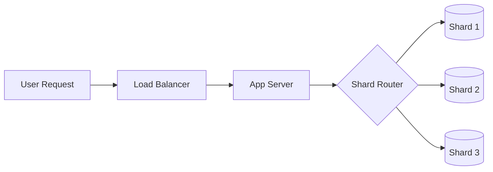

# How Big Tech Scales Databases: Sharding Explained

System design notes on horizontal scaling, data distribution, and the trade-offs of sharding at scale.

---

## 📌 The Problem: The Single Database Bottleneck

As an application grows, a single database node eventually hits a wall. You'll notice:

- **High Write Latency:** The disk can't keep up with the volume of incoming data.
- **Resource Exhaustion:** CPU and RAM max out trying to index and query massive tables.
- **Single Point of Failure:** If that one database goes down, the entire platform dies.

> **Result:** The system becomes unresponsive, leading to timeouts and crashes.

---

## ⚙️ The Solution: Sharding

Sharding is the process of breaking up a large database into smaller, more manageable chunks called **shards**.

- **Vertical Scaling:** Buying a bigger "box" (Expensive and has a ceiling).
- **Horizontal Scaling (Sharding):** Adding more "boxes" (Infinite potential).

### Architectural Shift
- **Before:** `Client ➔ App Server ➔ 1 Massive Database`
- **After:** `Client ➔ App Server ➔ Shard Router ➔ [Shard 1, Shard 2, Shard 3...]`

---

## 🧠 How Sharding Works (The Formula)

To distribute data, we use a **Sharding Key** (usually `user_id`, `order_id`, etc.) and a hashing function.

### The Modulo Hash
```bash
shard_index = user_id % N
```
*Where **N** is the number of shards.*

**Example with N = 3:**
- `User ID: 7` ➔ `7 % 3 = 1` ➔ **Shard 1**
- `User ID: 10` ➔ `10 % 3 = 1` ➔ **Shard 1**
- `User ID: 12` ➔ `12 % 3 = 0` ➔ **Shard 0**

---

## 🔀 The Routing Layer

The **Shard Router** acts as the brain of the operation. It sits between your application logic and your data layer to decide exactly which shard to query.



---

## ⚠️ The "Resharding Nightmare"

The biggest challenge in sharding is **adding a new shard** to an active system.

If you move from 3 shards to 4:
- **Old Rule:** `user_id % 3`
- **New Rule:** `user_id % 4`

**The Result:** A request for `User 7` which used to go to **Shard 1** now goes to **Shard 3**. Since the data hasn't moved yet, the system returns **"No Data Found."**

### Resharding Strategies

| Strategy | Logic | Pros | Cons |
| :--- | :--- | :--- | :--- |
| **1. Rebalance** | Move ALL data to new hashed locations. | Perfectly balanced. | Extremely expensive; High downtime risk. |
| **2. Chaining** | Keep old data in place; new users go to new shards. | Fast to implement. | Two sources of truth; messy routing logic. |
| **3. Gradual** | Move data in batches while updating the router. | Safest; zero downtime. | Complex to orchestrate and monitor. |

---

## 🔥 The Hotspot Problem

Even with sharding, you can hit **Uneven Distribution**. 

If `Shard 1` contains a "Celebrity User" (e.g., Cristiano Ronaldo or Elon Musk), that specific shard will be overwhelmed while `Shard 2` and `Shard 3` stay idle. This is known as a **Hotspot** or **Celebrity Problem**.

### The Fix: Consistent Hashing
Instead of simple modulo, we use a **Hash Ring**.
- Minimizes data movement during scaling.
- Allows for "Virtual Nodes" to balance the load more granularly.

---

## 📊 Summary Checklist
- [x] **Scalability:** Sharding allows for near-infinite horizontal growth.
- [x] **Complexity:** Sharding moves complexity from the DB to the Code/Router.
- [x] **Planning:** Choosing the right Shard Key is the most important decision.
- [x] **Future:** Consistent Hashing is the standard for high-scale systems.

---

## 🎥 Video Roadmap
https://youtu.be/ijOmSr86qzk


- **00:00** - Scaling Bottlenecks
- **01:02** - Visualizing the Architecture
- **02:14** - The Resharding Problem
- **02:33** - Migration Strategies
- **04:25** - Intro to Consistent Hashing

---

## 🔗 Next Up
👉 **Deep Dive:** How Consistent Hashing Solves the Resharding Nightmare.

---
** Created by The Engineer’s Lab **
https://www.youtube.com/@TheEngineersLabOfficial

```
